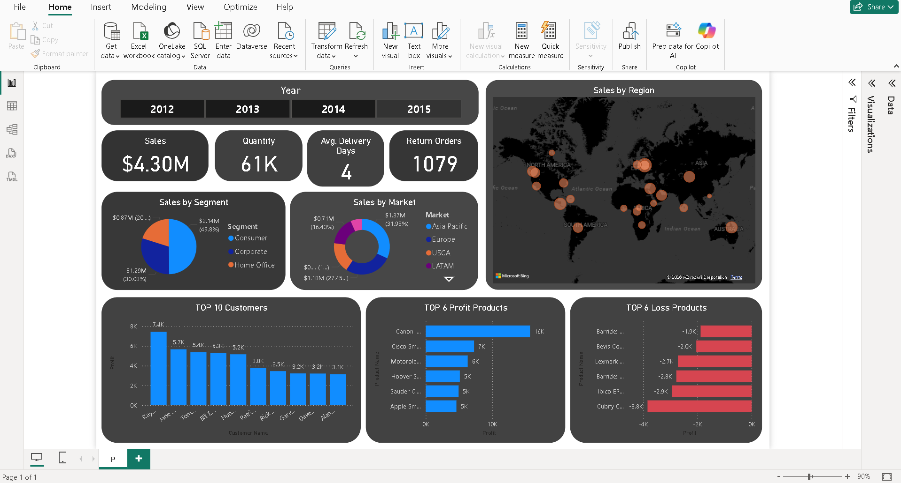

# Real-Time-Sales-Monitoring-Dashboard

📌 Overview

The Real-Time Sales Monitoring Dashboard is an interactive business intelligence solution developed using Power BI to provide comprehensive insights into sales performance, customer trends, and product profitability.

The dashboard enables stakeholders to monitor key performance indicators (KPIs), identify growth opportunities, and support data-driven decision-making through intuitive visualizations.

🎯 Key Objectives

Monitor overall sales and operational performance

Analyze customer contribution and purchasing behavior

Identify top-performing and loss-making products

Evaluate regional and market-wise sales distribution

Provide actionable insights for strategic planning

🛠️ Technology Stack

Power BI Desktop – Data visualization and dashboard development

Power Query – Data cleaning and transformation

DAX (Data Analysis Expressions) – KPI and measure creation

Excel / CSV Dataset – Data source

📊 Dashboard Highlights
Key Performance Indicators

Total Sales

Total Quantity Sold

Average Delivery Days

Total Return Orders

Visual Analytics

Sales by Segment Analysis

Market-wise Sales Distribution

Geographic Sales Mapping

Top 10 Customers by Contribution

Top Profit-Generating Products

Top Loss-Making Products

Interactive Features

Dynamic year slicer for time-based filtering

Interactive visuals enabling detailed exploration

⚙️ Methodology

Data Acquisition
Imported raw sales dataset into Power BI

Data Preparation
Cleaned and transformed data using Power Query to ensure accuracy and consistency

Data Modeling
Established relationships and created calculated columns

KPI Development
Designed DAX measures to track business metrics

Dashboard Design
Developed interactive visuals and applied best practices in data visualization

📈 Business Impact

Enables real-time monitoring of sales performance

Helps identify profitable and underperforming products

Improves understanding of customer behavior

Supports strategic decision-making with clear insights

Enhances reporting efficiency

🚀 Getting Started

Clone or download this repository

Open the .pbix file using Power BI Desktop

Refresh the dataset if required

Explore the interactive dashboard

📸 Dashboard Preview

📂 Repository Structure
Real-Time-Sales-Monitoring-Dashboard
│── Real-Time Sales Monitoring Dashboard.pbix
│── dashboard.png
│── README.md
🔮 Future Enhancements

Integration with live data sources

Implementation of predictive analytics and forecasting

Advanced drill-through and tooltip reports

Enhanced customer segmentation analysis

👩‍💻 Author

Keerthana S
Final Year Computer Science Engineering Student
